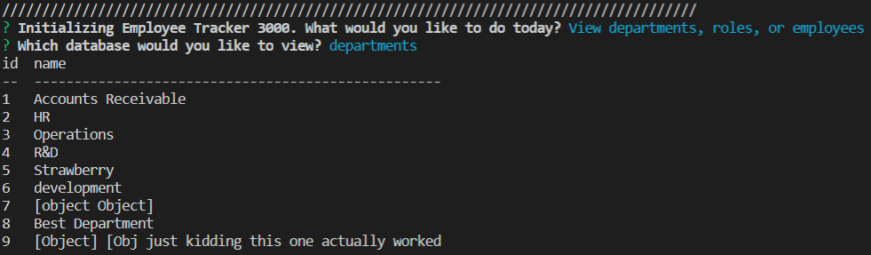

# Employee-Tracker

## Description 
A CLI build in node.js manipulating a database using the Sequelize NPM. A user can use the CLI to view or edit the database. 

## Images/GIFs

## Dependencies 
This app relies primarily on Sequelize to seed and manipulate the database, as well as Inquirer to get user input and console.table to display data from the database.

## Challenges
The biggest challenge of building this app was beoming familiar with Sequelize. I had to spend a lot of time getting used to learning from the documentation; I also got help from a tutor on structuring my files to best use sequelize. My file structure is still partially based on my initial attemps to use only MySQL, and ultimately could be cleaned up and seperated for easier reading.

Ultimately my update employee function is not yet fully functional; I wasn't able to pull the correct employee to be modified. 

